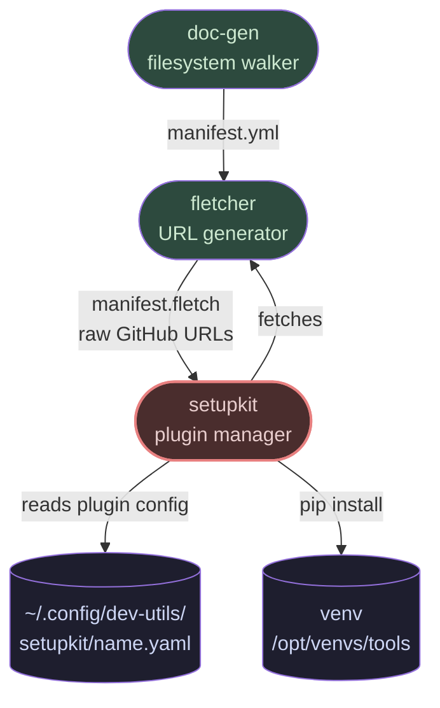

# README.md

**Path:** python/setupkit/README.md
**Syntax:** markdown
**Generated:** 2026-05-11 15:11:09

```markdown
# setupkit

Plugin lifecycle manager for the dev-utils / Project Crew ecosystem.

Installs, updates, and checks the status of Project Crew packages — dbkit,
viewkit, fletcher, menukit, and others — without requiring manual pip paths
or version tracking.

setupkit is a convenience tool that depends on the
[doc-gen](https://github.com/carolynboyle/doc-gen) / fletcher pipeline to
read upstream package metadata. It is not a prerequisite for any other
dev-utils package. All other packages can be installed independently with a
standard `pip install .`.

---

## How It Fits In

setupkit sits at the end of the doc-gen documentation and provisioning
pipeline:



---

## Installation

```bash
cd ~/projects/dev-utils/python/setupkit
pip install -e .
```

Or install into the shared tools venv:

```bash
/opt/venvs/tools/bin/pip install -e ~/projects/dev-utils/python/setupkit
```

To bootstrap the tools venv from scratch, use the bootstrap script in the
`setup/` directory:

```bash
bash setup/setup.sh
```

The bootstrap script uses `curl` and `unzip` to download setupkit from
GitHub — it does not require `git` to be installed. All other steps require
only `python3` and `pip`.

Verify:

```bash
setupkit --help
```

---

## Dependencies

setupkit requires [doc-gen](https://github.com/carolynboyle/doc-gen) and
fletcher to be part of your workflow. It reads `manifest.fletch` files
generated by that pipeline to determine upstream package versions and install
paths. Without an initialized plugin config (see `setupkit init`), setupkit
cannot check or install a package.

---

## Concepts

### Plugin config

Each managed package has a config file at
`~/.config/dev-utils/setupkit/<name>.yaml`. These are generated by
`setupkit init` and can be edited manually.

```yaml
# setupkit plugin config — generated by setupkit init
# Edit manually or regenerate with: setupkit init dbkit

name: dbkit
version: 0.1.0
manifest_url: https://raw.githubusercontent.com/carolynboyle/dev-utils/main/.doc-gen/manifest.fletch
pyproject: python/dbkit/pyproject.toml
path_prefix: python/dbkit/dbkit/
install:
  method: pip
  url: git+https://github.com/carolynboyle/dev-utils.git#subdirectory=python/dbkit
```

### manifest.fletch

A YAML file generated by fletcher containing repo metadata and raw GitHub
URLs for all project files. setupkit fetches this at runtime to read the
upstream version and resolve install paths. It does not cache the manifest
locally.

### Version checking

setupkit reads the locally installed version using `importlib.metadata`
(works with both regular and editable installs) and compares it against
the `version:` field in `manifest.fletch` using `packaging.version` for
correct semantic version ordering.

---

## Usage

### Init — generate a plugin config

```bash
setupkit init dbkit
```

Interactive wizard that:
1. Detects or prompts for the manifest.fletch URL
2. Fetches the manifest and reads the file list
3. Presents path prefixes for selection
4. Infers the pyproject.toml path
5. Suggests a `git+` install URL
6. Writes `~/.config/dev-utils/setupkit/dbkit.yaml`

Run once per plugin per machine. Re-run to regenerate or update an existing
config (shows a diff and prompts for confirmation before overwriting).

### Check — inspect without installing

```bash
# Check one plugin
setupkit check dbkit

# Check all configured plugins
setupkit check
```

Fetches the upstream manifest and reports whether the plugin is missing,
up to date, or has an update available. Makes no changes.

Example output:

```
dbkit 0.1.0 → 0.2.0 (update available)
viewkit 0.2.1 is up to date
menukit is not installed (upstream: 0.1.0)
```

> **Note:** If `upstream` shows `None`, the plugin has not been initialized
> on this machine. Run `setupkit init <package>` first.

### Install — install or update

```bash
# Install or update one plugin
setupkit install dbkit

# Install or update all configured plugins
setupkit install

# Force reinstall even if already up to date
setupkit install dbkit --force
```

Skips installation if the plugin is already at the upstream version.
Use `--force` to reinstall regardless. On failure, continues to the next
plugin rather than aborting the entire run.

---

## Configuration

setupkit ships defaults in `src/setupkit/data/setupkit.yaml`:

```yaml
setupkit:
  config_dir: ~/.config/dev-utils/setupkit
  log_dir: ~/.local/share/dev-utils
  venv_path: /opt/venvs/tools
```

To override, add a `setupkit:` section to `~/.config/dev-utils/config.yaml`.
Only the keys you specify are overridden — the rest come from the shipped
defaults.

```yaml
# ~/.config/dev-utils/config.yaml
setupkit:
  log_dir: ~/logs/dev-utils
  venv_path: /opt/venvs/tools
```

---

## Data Flow

```mermaid
flowchart TD
    subgraph init ["setupkit init"]
        I1[Detect git remote] --> I2[Fetch manifest.fletch]
        I2 --> I3[Present file list]
        I3 --> I4[Select path prefix]
        I4 --> I5[Infer pyproject.toml]
        I5 --> I6[Confirm install URL]
        I6 --> I7[Write plugin config yaml]
    end

    subgraph check ["setupkit check / install"]
        C1[Load plugin config yaml] --> C2[Fetch manifest.fletch]
        C2 --> C3[Read upstream version]
        C3 --> C4{Version check}
        C4 -->|not installed| C5[pip install]
        C4 -->|update available| C5
        C4 -->|up to date| C6[Skip]
        C4 -->|force flag| C5
        C5 --> C7[InstallResult: installed/updated]
        C6 --> C8[InstallResult: skipped]
    end

    style init fill:#1e2e1e,color:#cde8cd
    style check fill:#1e1e2e,color:#cddcf4
```



---

## Public API

setupkit exposes a Python API for use by other tools or orchestration scripts.

```python
from setupkit import (
    init_plugin,      # interactive config generator
    install_plugin,   # install or update one plugin
    install_all,      # install or update all configured plugins
    check_plugin,     # check one plugin without installing
    check_all,        # check all plugins without installing
    InstallResult,    # result dataclass
    PluginConfig,     # plugin config dataclass
    ManifestData,     # parsed manifest.fletch dataclass
    VersionInfo,      # version check result dataclass
)
```

### InstallResult

```python
@dataclass
class InstallResult:
    plugin: str
    action: str          # 'installed' | 'updated' | 'skipped' | 'checked' | 'failed'
    version_info: VersionInfo | None
    message: str
    success: bool
```

---

## Exception Hierarchy

```
SetupKitError
├── PluginConfigError   — plugin config missing, unreadable, or invalid
├── ManifestError       — manifest.fletch fetch or parse failure
├── VersionError        — version string missing or unparseable
└── InstallError        — pip install subprocess failure
```

All exceptions inherit from `SetupKitError`. Catch the base class if you
don't need to distinguish between failure modes.

`install_all` and `check_all` do not raise on individual plugin failures —
they collect failures into `InstallResult` entries with `success=False` and
continue to the next plugin.

---

## Logging

setupkit writes to two destinations:

- `~/.local/share/dev-utils/setupkit.log` — INFO and above (rotating file,
  1MB per file, 3 backups retained)
- stderr — WARNING and above (terminal, visible only on problems)

Log location is configurable via the `log_dir` key in
`~/.config/dev-utils/config.yaml`.

---

## Roadmap

### Provisioning script

A provisioning script is planned that will automate setup on a fresh machine:
install system dependencies, create the tools venv, run `setupkit init` for
each plugin, and produce a report of what was installed and whether each
package is functioning correctly.

### filter_files

`setupkit.manifest.filter_files` is implemented but not yet wired into the
install workflow. It filters a manifest's file list to only the entries
belonging to a specific plugin, using `path_prefix` and the explicit
`pyproject` path. Planned use: selective re-fetch of individual plugin
source files without downloading the entire repo manifest.

### Additional install methods

The `install.method` field in plugin configs currently supports `pip` only.
The architecture reserves the field for future methods (e.g. direct file
copy from a devshare path for packages that don't need a full pip install).

---

## Part of dev-utils

setupkit is one tool in the dev-utils collection:

- **[doc-gen](https://github.com/carolynboyle/doc-gen)** — walks the
  filesystem and generates `manifest.yml` *(external repo)*
- **fletcher** — reads `manifest.yml` and generates `manifest.fletch` with
  raw GitHub URLs
- **setupkit** — reads `manifest.fletch` and manages plugin installation
- **dbkit** — database abstraction layer (PostgreSQL + SQLite)
- **viewkit** — YAML-driven SQL view and query builder
- **menukit** — YAML-driven CLI menu library
- **todo** — JSON-backed todo list manager
- **contactkit** — multi-format contact import and CLI interface

All tools are standalone and compose cleanly as libraries or pipeline stages.

---

## Author

Carolyn Boyle

---

## License

MIT. See `LICENSE` in this directory.

```
